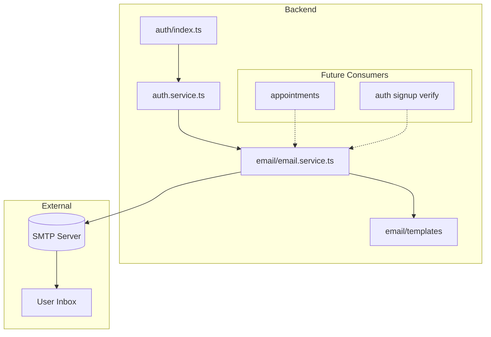

# Email Infrastructure and Forgot Password

## Architecture Overview



---

## 1. Email Module (New - Reusable Foundation)

Create `backend/src/modules/email/` as a shared module used by auth, appointments, and future features.

**Layout:**

```
email/
├── email.schemas.ts      # (none for now - module is internal)
├── email.service.ts      # sendEmail(), sendPasswordReset(), future: sendAppointmentConfirmation(), etc.
├── email.templates.ts    # Template builders (subject, text, html) per email type
├── email.types.ts        # EmailType enum, SendEmailOptions, template payloads
└── index.ts              # Exports (no routes - email is internal)
```

**Core design:**

- `**email.types.ts` – Define `EmailType` union: `"password_reset" | "signup_verification" | "appointment_confirmation" | "appointment_reminder" | "video_call_link" | "appointment_cancelled" | "appointment_rescheduled"`. Each type has a payload interface. Add new types as needed.
- `**email.templates.ts` – Functions like `buildPasswordResetEmail(to, resetLink)`, `buildAppointmentConfirmationEmail(...)` (placeholder for later). Return `{ subject, text, html? }`. Keep templates simple (no external engine for MVP).
- `**email.service.ts` –
  - `sendEmail(to, subject, text, html?)` – Low-level Nodemailer send.
  - `sendPasswordReset(to, resetLink)` – Uses template, calls sendEmail.
  - Future: `sendAppointmentConfirmation(...)`, `sendAppointmentReminder(...)`, etc. Each delegates to template + sendEmail.
- **Config** – Add to [backend/src/config/index.ts](backend/src/config/index.ts): `smtpHost`, `smtpPort`, `smtpUser`, `smtpPass`, `mailFrom`, `appBaseUrl` (for reset links). All optional in dev; require in production when email is used.

**Env vars** (add to `backend/.env.example`):

```
# Email (Nodemailer)
SMTP_HOST=smtp.example.com
SMTP_PORT=587
SMTP_USER=
SMTP_PASS=
MAIL_FROM=TeleCare <noreply@example.com>
APP_BASE_URL=http://localhost:3000
```

---

## 2. Forgot Password Flow

**Endpoints:**

| Method | Path                           | Description                               |
| ------ | ------------------------------ | ----------------------------------------- |
| POST   | `/api/v1/auth/forgot-password` | Request reset; sends email if user exists |
| POST   | `/api/v1/auth/reset-password`  | Reset with token + new password           |

**Schemas** ([auth/auth.schemas.ts](backend/src/modules/auth/auth.schemas.ts)):

- `forgotPasswordSchema`: `{ email }`
- `resetPasswordSchema`: `{ token, newPassword }` (min 8 chars)

**Auth service** ([auth/auth.service.ts](backend/src/modules/auth/auth.service.ts)):

- `requestPasswordReset(email)`:
  - Find user by email. If not found, return success anyway (no user enumeration).
  - Generate secure token (e.g. `crypto.randomBytes(32).toString('hex')`).
  - Set `passwordResetToken`, `passwordResetExpires` (e.g. 1 hour).
  - Build reset link: `{APP_BASE_URL}/reset-password?token={token}`.
  - Call `emailService.sendPasswordReset(user.email, resetLink)`.
  - Return `{ message: "If an account exists, a reset link was sent" }`.
- `resetPassword(token, newPassword)`:
  - Find user where `passwordResetToken = token` and `passwordResetExpires > now`.
  - If not found or expired, throw 400 with generic message.
  - Hash new password, update user, clear `passwordResetToken` and `passwordResetExpires`.
  - Return success (optional: return token for auto-login; can defer).

**Routes** ([auth/index.ts](backend/src/modules/auth/index.ts)): Wire both endpoints; validate with schemas, call service, respond.

---

## 3. Frontend Pages

- `**/forgot-password` – Form: email only. Submit to `POST /auth/forgot-password`. Show success message regardless (no enumeration).
- `**/reset-password` – Read `token` from query. Form: newPassword, confirmPassword. Submit to `POST /auth/reset-password`. On success, redirect to login. Match existing auth layout (e.g. reuse login/signup styling).

---

## 4. Future-Ready Hooks (No Implementation Now)

Document in plan / code comments so future work is straightforward:

- **Signup verification** – `verificationToken` on User. Add `sendSignupVerification(to, verifyLink)` to email service; auth service calls it after signup when feature is enabled.
- **Appointment confirmations** – After `appointments.service` confirms, call `emailService.sendAppointmentConfirmation(to, appointmentDetails)`.
- **Appointment reminders** – Cron or queue job; call `emailService.sendAppointmentReminder(to, appointmentDetails, joinLink)` with Daily link when video is integrated.
- **Cancellations / reschedules** – Same pattern: `sendAppointmentCancelled`, `sendAppointmentRescheduled`.

**Email types and template stubs** – Define in `email.types.ts` and add stub template functions in `email.templates.ts` that return placeholder content. Implement full logic when those features are built.

---

## 5. Implementation Order

1. **Email module** – Types, templates (password reset only), service, config, Nodemailer setup.
2. **Auth forgot/reset** – Schemas, service methods, routes.
3. **Frontend** – Forgot-password and reset-password pages.
4. **Plan update** – Add email + forgot-password to [.cursor/plans/telecare-mvp-architecture_b1a0a351.plan.md](.cursor/plans/telecare-mvp-architecture_b1a0a351.plan.md).
5. **Rule update** – Extend [.cursor/rules/backend-module-structure.mdc](.cursor/rules/backend-module-structure.mdc) to mention internal modules (e.g. email) with no routes.

---

## 6. Dependencies

- Add `nodemailer` and `@types/nodemailer` to [backend/package.json](backend/package.json).

---

## 7. Security Notes

- Token: cryptographically random, single-use, expire in 1 hour.
- Same success response for forgot-password whether user exists or not.
- Reset link must use HTTPS in production (`APP_BASE_URL`).
