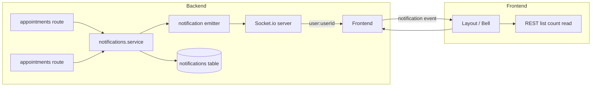

# Real-time notification system ([Socket.io](http://Socket.io))

## Current state

- **Backend**: [backend/src/socket.ts](backend/src/socket.ts) already joins each connected socket to `user:${userId}` (line 62). Same server runs Express + Socket.io; auth via `handshake.auth.token`.
- **Frontend**: [frontend/src/services/socket.ts](frontend/src/services/socket.ts) is consultation-centric (connects when used, joins consultation room). Token from `localStorage`. [frontend/src/components/Layout.tsx](frontend/src/components/Layout.tsx) has a static Bell with a placeholder red dot (lines 132–135).
- **Prescriptions**: Created in [backend/src/modules/appointments/index.ts](backend/src/modules/appointments/index.ts) via `prescriptionsService.createPrescription`; no appointment confirm/decline API yet (comment on line 79).

## Architecture

- **Persistence**: Every notification is stored (so list and badge work after refresh and across devices).
- **Real-time**: After creating a notification, backend emits to `user:${userId}`; frontend listens for `notification` and updates UI.
- **Decoupling**: Prescription/appointment code calls a notification service; a small emitter (set once in server) pushes to Socket.io so modules do not depend on `io` directly.

---

## 1. Database: Notification model

**File**: [backend/prisma/schema.prisma](backend/prisma/schema.prisma)

- Add enum `NotificationType`: `PRESCRIPTION_CREATED`, `APPOINTMENT_CONFIRMED`, `APPOINTMENT_DECLINED`, `APPOINTMENT_REQUESTED` (and later e.g. `APPOINTMENT_CANCELLED`).
- Add model `Notification`:
  - `id` (UUID), `userId` (FK → User.id, indexed), `type` (NotificationType), `title` (String), `body` (String?, optional detail), `read` (Boolean, default false), `metadata` (Json? — e.g. `{ prescriptionId, appointmentId }` for deep links), `createdAt`.
  - Indexes: `(userId, createdAt DESC)` for list, `(userId, read)` for unread count.
- Add relation on `User`: `notifications Notification[]`.
- Run migration.

---

## 2. Backend: notifications module

**Layout** (follow [.cursor/rules/backend-module-structure.mdc](.cursor/rules/backend-module-structure.mdc)):

- `backend/src/modules/notifications/`
  - `notifications.schemas.ts` — Zod: query params for list (limit, cursor/before), mark-read body if needed.
  - `notifications.service.ts` — Pure DB + business logic:
    - `create(userId, type, { title, body?, metadata? })` → create record, return notification (no Socket here).
    - `listForUser(userId, { limit, before? })` — paginated by createdAt.
    - `getUnreadCount(userId)`.
    - `markRead(userId, notificationId)` and `markAllRead(userId)`.
  - `index.ts` — Routes under `/notifications` (or `/users/me/notifications`):
    - `GET /` — list (requireAuth, use `user.sub`).
    - `GET /unread-count` — count.
    - `PATCH /:id/read`, `PATCH /read-all`.

**Emitter (no dependency on notifications module)**:

- `backend/src/notifications-emitter.ts` (or `backend/src/lib/notifications-emitter.ts`):
  - Store optional `emitFn: (userId: string, payload: object) => void`.
  - `setNotificationEmitter(fn)` — called once from server with `(userId, data) => io.to('user:'+userId).emit('notification', data)`.
  - `emitToUser(userId, payload)` — call `emitFn` if set.
- In [backend/src/server.ts](backend/src/server.ts): after `const io = initializeSocket(server)`, call `setNotificationEmitter((userId, data) => io.to('user:'+userId).emit('notification', data))`.

So: when a prescription (or later appointment) is created/updated, the route or its service calls `notifications.service.create(...)`, then `emitToUser(recipientUserId, createdNotification)` so the socket layer stays in one place.

---

## 3. Emit when prescription is created

- In [backend/src/modules/appointments/index.ts](backend/src/modules/appointments/index.ts), after successful `createPrescription`:
  - The returned prescription has `patientId` (Patient.id). Fetch `patient.userId` (e.g. include in service return or one extra query) — recipient is the patient’s **User** id.
  - Call `notificationsService.create(patientUserId, 'PRESCRIPTION_CREATED', { title: '...', body: '...', metadata: { prescriptionId, appointmentId } })`.
  - Call `emitToUser(patientUserId, notification)` (use the same object returned from create, or a minimal payload with id, type, title, createdAt, metadata).
- Keep prescriptions service free of emitter/io; orchestration in the route or a thin wrapper is fine.

---

## 4. Appointment confirm/decline (future-proof)

- When you add appointment status transitions (e.g. `PATCH /appointments/:id/status` with CONFIRMED / CANCELLED_BY_DOCTOR):
  - After updating status, create a notification for the **patient** (get `appointment.patient.userId`) with type `APPOINTMENT_CONFIRMED` or `APPOINTMENT_DECLINED`, then `emitToUser(patientUserId, notification)`.
  - Optional: when a patient creates a booking (PENDING), create `APPOINTMENT_REQUESTED` for the **doctor** (`appointment.doctor.userId` via DoctorProfile → User) and emit.
- No schema change needed; just add these notification types and call the same `create` + `emitToUser` pattern.

---

## 5. Frontend: Socket connection for notifications

- **Single socket**: Reuse the same Socket.io connection for consultation and notifications (already joins `user:${userId}`).
- **Connect when authenticated**: So the user receives notifications on dashboard without being in a consultation. Options:
  - **A)** In [frontend/src/services/socket.ts](frontend/src/services/socket.ts): expose `connect()` and call it from a root layout or auth callback when token exists (e.g. after login or when Layout mounts for a protected route). Ensure one shared instance is used for both consultation and notifications.
  - **B)** Or a small `useNotificationSocket()` hook that gets/create the same socket, calls `connect()` if not connected, and subscribes to `'notification'`. Layout (or a NotificationsProvider) uses this hook so the socket is active whenever the user is logged in and on the app.
- **Event**: Listen for `'notification'`; payload can mirror the REST notification shape (id, type, title, body, metadata, createdAt). On event: append to local list (or refetch) and bump unread count so the bell and list update in real time.

---

## 6. Frontend: REST API and types

- In [frontend/src/services/api.ts](frontend/src/services/api.ts) (or a dedicated notifications API file): add `notificationsApi` with:
  - `list(params?: { limit?, before? })`
  - `getUnreadCount()`
  - `markRead(id)`, `markAllRead()`
- Use same `fetchWithAuth` and base URL. Define a `Notification` type (id, userId?, type, title, body?, read, metadata?, createdAt).

---

## 7. Frontend: Bell UI in Layout

- In [frontend/src/components/Layout.tsx](frontend/src/components/Layout.tsx):
  - Replace the static Bell with a notification bell component that:
    - Fetches initial list (and unread count) when dropdown opens (or on mount with a short list).
    - Subscribes to Socket `'notification'` (via the shared socket + hook or provider) and updates list + unread count on event.
    - Shows a badge (e.g. red dot or count) from unread count; hide when 0.
    - Dropdown (or slide-out): list of notifications (title, time, optional type icon); click → mark read and optionally navigate (using metadata.appointmentId / prescriptionId).
    - Optional: “Mark all as read” in the dropdown.
  - Pagination: load more on scroll in dropdown, or “View all” link to a `/notifications` page later.

---

## 8. Scalability and real-life use

- **Pagination**: List endpoint is cursor-based (e.g. `before=createdAt`) so the bell dropdown stays fast; “view all” can be a separate page.
- **Retention**: Optional cleanup (e.g. delete or archive notifications older than 90 days) via a later cron or scheduled job; not required for MVP.
- **Deep links**: `metadata` carries `prescriptionId`, `appointmentId` so the client can link to `/patient/prescriptions/...` or appointment detail.
- **Email + in-app**: Keep sending emails for key events (as in your email plan); in-app is for users already on the platform.
- **One socket per user**: Same connection for consultation room and notifications; no extra connections. When Socket.io is scaled (e.g. Redis adapter), `user:${userId}` rooms work with sticky sessions or adapter broadcast.

---

## Implementation order

1. Prisma: add `NotificationType` enum and `Notification` model; migrate.
2. Backend: notifications module (schemas, service, routes); register routes under `/api/v1`.
3. Backend: notifications emitter + wire it in `server.ts`; emit after prescription create in appointments route (resolve patient’s `userId`).
4. Frontend: notifications API and types; ensure socket connects when authenticated and add `'notification'` listener.
5. Frontend: notification bell component (dropdown, list, badge, mark read) and integrate into Layout.
6. Later: when appointment confirm/decline (and optional “requested”) exist, add the corresponding `create` + `emitToUser` calls.

---

## Files to add or touch (summary)

| Area                                                     | Action                                                                             |
| -------------------------------------------------------- | ---------------------------------------------------------------------------------- |
| `backend/prisma/schema.prisma`                           | Add enum + Notification model + User relation; migration                           |
| `backend/src/modules/notifications/`                     | New module (schemas, service, routes)                                              |
| `backend/src/notifications-emitter.ts` (or `lib/`)       | New; setEmitter + emitToUser                                                       |
| `backend/src/server.ts`                                  | Call setNotificationEmitter(io) after init                                         |
| `backend/src/routes/index.ts`                            | Mount notifications router                                                         |
| `backend/src/modules/appointments/index.ts`              | After createPrescription: create notification, emitToUser (resolve patient userId) |
| `frontend/src/services/api.ts` (or `notifications.ts`)   | notificationsApi (list, unreadCount, markRead, markAllRead)                        |
| `frontend/src/services/socket.ts`                        | Connect when token exists; add onNotification listener / expose for Layout         |
| `frontend/src/components/Layout.tsx`                     | Replace Bell with notification bell component (dropdown, badge, list)              |
| Optional: `frontend/src/components/NotificationBell.tsx` | Extract bell + dropdown + list + socket subscription                               |

No new dependencies; Socket.io and existing auth/patterns are reused.
